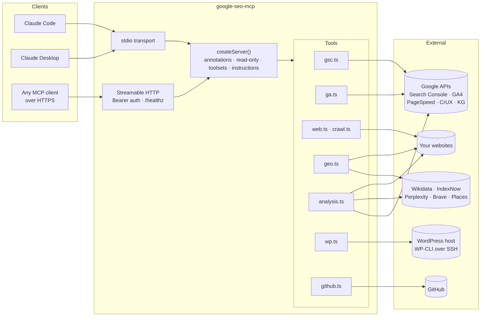

<div align="center">

# google-seo-mcp

**SEO & GEO MCP server for Claude and other AI agents — Google Search Console, Google Analytics 4, PageSpeed Insights, structured data, llms.txt, WordPress and GitHub as 80 tools, so an assistant can diagnose and fix technical SEO, content and generative-engine-optimization issues in one conversation.**

[](https://github.com/Akxan/google-seo-mcp/stargazers)
[](LICENSE)
[](https://nodejs.org)
[](https://www.typescriptlang.org)
[](https://modelcontextprotocol.io)
[](#what-it-can-do)
[](https://github.com/Akxan/google-seo-mcp/commits/main)

Google Search Console · Google Analytics 4 · PageSpeed & CrUX · on-page and GEO audits · WordPress over SSH · GitHub

[Quick start](#quick-start) · [Tools](#what-it-can-do) · [Architecture](#architecture) · [Configuration](#configuration) · [Deploy 24/7](#running-as-a-247-http-server) · [中文文档](README.zh-CN.md)

</div>

---

## Why

**google-seo-mcp** is a [Model Context Protocol](https://modelcontextprotocol.io) server for **SEO automation with AI agents**. It connects **Google Search Console**, **Google Analytics 4 (GA4)**, **PageSpeed Insights / Core Web Vitals**, the **Chrome UX Report**, **Knowledge Graph**, **Wikidata**, **IndexNow**, **WordPress** (Yoast SEO, WP-CLI over SSH) and **GitHub**, and adds **GEO (generative engine optimization)** checks: AI crawler access for GPTBot, OAI-SearchBot, ClaudeBot and PerplexityBot, `llms.txt`, JSON-LD / schema.org structured data, E-E-A-T signals and AI citation tracking.

Most SEO MCP servers wrap one API. Real SEO work crosses several: you find a striking-distance keyword in Search Console, check the landing page's engagement in GA4, audit the page, rewrite its title and FAQ, publish the change to WordPress or a static-site repo, then watch the numbers. This server gives an assistant every step of that loop as tools, with the guard-rails a public-facing site needs: read-only mode, destructive-action annotations, and untrusted-content instructions.

## What it can do

| Area | Tools |
|---|---|
| **Search Console** (16) | `gsc_list_sites`, `gsc_search_analytics`, `gsc_site_snapshot`, `gsc_compare_periods`, `gsc_opportunities` (position 8–20 quick wins), `gsc_ctr_opportunities`, `gsc_cannibalization`, `gsc_question_queries`, `gsc_rich_results_report`, `gsc_inspect_url`, `gsc_index_coverage`, `gsc_list_sitemaps` / `gsc_submit_sitemap` / `gsc_delete_sitemap`, `gsc_add_site` / `gsc_delete_site` |
| **Google Analytics 4** (11) | `ga_list_properties`, `ga_property_config` (streams, custom dimensions/metrics, key events, audiences, Ads links, retention — read-only), `ga_run_report`, `ga_batch_run_reports`, `ga_run_pivot_report`, `ga_run_funnel_report`, `ga_run_realtime_report`, `ga_get_metadata`, `ga_check_compatibility`, `ga_compare_periods`, `ga_landing_page_seo` (organic landing pages merged with Search Console) |
| **Page & site audits** (9) | `page_audit`, `site_crawl`, `pagespeed`, `sitemap_check`, `robots_check`, `hreflang_check`, `social_preview_check`, `compare_pages`, `keyword_suggest` |
| **GEO** (12) | `ai_crawler_access`, `llms_txt_check`, `llms_txt_generate`, `structured_data_audit`, `schema_generate`, `schema_validate`, `geo_page_score`, `eeat_audit`, `knowledge_graph_check`, `indexnow_submit`, `ai_citation_check`, `brand_mentions` |
| **Analysis** (5) | `migration_check` (pre-migration URL safety net), `cross_site_links`, `content_refresh_candidates`, `crux_history`, `reviews_snapshot` |
| **WordPress** (21, optional) | posts, Yoast SEO fields (single & bulk), BeTheme / Muffin Builder content, media alt text, categories & tags, internal-link suggestions, Yoast Premium redirects, JSON-LD injection, raw WP-CLI |
| **GitHub** (5, optional) | `github_get_file`, `github_list_dir`, `github_search_code`, `github_list_commits`, `github_commit_files` (atomic multi-file commits, so a static site can be edited from any client) |

Plus `google_auth_status` for diagnostics. Every tool carries MCP annotations (`readOnlyHint`, `destructiveHint`, `idempotentHint`), the server publishes `instructions` for the model, and there is a read-only mode and toolset filtering.

<details>
<summary><b>Example prompts</b></summary>

- *"Give me a snapshot of example.com for the last 28 days."*
- *"Which queries rank between 8 and 20 with the most impressions, and which posts are they on?"*
- *"Audit https://example.com/guide and score it for AI answer engines."*
- *"Find question-style queries we already get impressions for and tell me where a FAQ is missing."*
- *"Check whether GPTBot, PerplexityBot and ClaudeBot can reach the homepage."*
- *"Before we move to the new host, verify every URL with traffic still resolves on new.example.com."*
- *"Rewrite the SEO title and meta description of post 515 and publish it."*

</details>

## Tech stack

| Layer | Choice | Notes |
|---|---|---|
| Runtime | Node.js ≥ 18, TypeScript 5, ES modules | no build-time codegen, `tsc` only |
| Protocol | `@modelcontextprotocol/sdk` | stdio for local clients, stateless Streamable HTTP for servers |
| Google | `googleapis` (Search Console v1, Analytics Data v1beta, Analytics Admin v1beta) + `google-auth-library` | REST clients, no gRPC; service account or OAuth |
| Web audits | `cheerio`, `image-size`, native `fetch` | PageSpeed Insights, CrUX, Knowledge Graph, Wikidata, Google Autocomplete, IndexNow, Perplexity, Brave, Places APIs over HTTPS |
| WordPress | `ssh` + WP-CLI, two PHP helpers uploaded on first use | Yoast indexable rebuild, cache purge (WP Rocket / Super Cache / W3TC / LiteSpeed), mu-plugin for JSON-LD |
| GitHub | REST + Git Data API | token from `GITHUB_TOKEN` or `gh auth token` |
| Validation | `zod` schemas per tool | descriptions double as LLM documentation |
| Quality | smoke test with tool-list snapshot, secret-scan git hooks | `npm test`, `npm run check:secrets` |

## Architecture



**Request path.** A client calls a tool → `src/util.ts` `tool()` wraps the handler (JSON result or an actionable `isError`) → the handler talks to one or more upstreams → results are flattened into compact JSON (`{dimension: value, metric: number}` rows, totals first). Long-running tools (`pagespeed`, `site_crawl`, `migration_check`) send progress notifications.

**Cross-source analyses** (`ga_landing_page_seo`, `migration_check`, `cross_site_links`, `content_refresh_candidates`, `gsc_opportunities`) reuse the Search Console query function and a shared URL-path normaliser so pages line up across GA4, Search Console, sitemaps and WordPress post IDs.

**WordPress path.** Every call is `ssh host 'cd <wp> && wp …'` with POSIX-quoted arguments; large payloads go over stdin. Two PHP helpers are uploaded to `~/.google-seo-mcp/` on the host when their hash changes. Yoast meta writes trigger an indexable rebuild and a cache purge so changes are live immediately.

**Safety.** Write tools are recognised by name and receive `readOnlyHint:false` (`destructiveHint:true` for deletes, raw WP-CLI and commits). `--read-only` drops them at registration; `--toolsets=gsc,web` trims the tool list (80 definitions ≈ 22k tokens). Server instructions tell the model that fetched page text and CMS content are untrusted data.

## Quick start

Requirements: Node 18+, a Google Cloud project with the **Search Console API**, **Google Analytics Data API** and **Google Analytics Admin API** enabled.

```bash
git clone https://github.com/Akxan/google-seo-mcp.git
cd google-seo-mcp
npm install
npm run build
cp .env.example .env      # fill in credentials (see below)
```

### Google credentials

**Service account (recommended, works unattended):** create a service account in the Cloud project, download its JSON key, set `GOOGLE_APPLICATION_CREDENTIALS=/path/to/key.json` in `.env`, then add the service-account email as a user on each Search Console property (permission *Full*) and each GA4 property (role *Viewer*).

**Your own Google account (OAuth):** create an OAuth client ID of type *Desktop app*, download `client_secret.json`, run

```bash
npm run auth -- --client-secret ./client_secret.json
```

and the resulting `~/.config/google-seo-mcp/credentials.json` is picked up automatically.

Lookup order: `GOOGLE_CREDENTIALS_JSON` (inline) → `GOOGLE_APPLICATION_CREDENTIALS` → `~/.config/google-seo-mcp/credentials.json` → Application Default Credentials.

### Connect a client

Claude Code:

```bash
claude mcp add google-seo -- node /absolute/path/google-seo-mcp/dist/index.js
```

Claude Desktop (`claude_desktop_config.json`):

```json
{
  "mcpServers": {
    "google-seo": {
      "command": "node",
      "args": ["/absolute/path/google-seo-mcp/dist/index.js"]
    }
  }
}
```

The server reads `.env` from its own directory at startup, so client configs need nothing but the command. Environment variables passed by the client take precedence.

## Configuration

All settings live in `.env` (see [`.env.example`](.env.example), which documents every key).

| Variable | Purpose |
|---|---|
| `GOOGLE_APPLICATION_CREDENTIALS` / `GOOGLE_CREDENTIALS_JSON` | Google auth |
| `PAGESPEED_API_KEY` | PageSpeed Insights (free; without it you share a public quota that is usually exhausted) |
| `CRUX_API_KEY`, `GOOGLE_API_KEY` | Chrome UX Report API, Knowledge Graph Search API (free; fall back to `PAGESPEED_API_KEY`) |
| `BRAVE_API_KEY`, `PERPLEXITY_API_KEY`, `GOOGLE_PLACES_API_KEY` | optional: brand mentions, AI citation check, Google reviews |
| `INDEXNOW_KEY`, `INDEXNOW_KEY_LOCATION` | optional: IndexNow submissions |
| `GITHUB_TOKEN` | GitHub tools (falls back to `gh auth token`) |
| `WP_SITES` | JSON array of WordPress sites reachable over SSH; omit to disable `wp_*` tools |
| `SEO_MCP_READ_ONLY=1` or `--read-only` | register no write tools |
| `SEO_MCP_TOOLSETS` or `--toolsets=` | comma list of `gsc,ga4,web,geo,analysis,wordpress,github` |
| `MCP_TRANSPORT=http`, `MCP_HOST`, `MCP_PORT`, `MCP_PATH`, `MCP_AUTH_TOKEN` | HTTP mode |

Tools that need an optional key return an error explaining how to obtain it instead of silently disappearing.

### WordPress over SSH

```
WP_SITES=[{"name":"mysite","host":"1.2.3.4","port":22,"user":"ssh_user","path":"domains/example.com/public_html"}]
```

Needs WP-CLI on the host and passwordless SSH from the machine running the server. Posts built with BeTheme's Muffin Builder (empty `post_content`) are handled by the `wp_builder_*` tools. `wp_set_schema` installs a 5-line mu-plugin that prints stored JSON-LD in `<head>`.

## Running as a 24/7 HTTP server

```bash
MCP_TRANSPORT=http MCP_AUTH_TOKEN=$(openssl rand -hex 32) node dist/index.js --http
curl http://127.0.0.1:8080/healthz
```

Stateless Streamable HTTP: a fresh server instance per request, Bearer-token auth, loopback bind by default. `deploy/vps-self-update.sh` updates a Docker deployment in place, and `.github/workflows/deploy.yml` runs it on every push to `main` through a forced-command SSH deploy key stored in repository secrets (`VPS_HOST`, `VPS_USER`, `VPS_SSH_KEY`, `VPS_KNOWN_HOSTS`). [`deploy/`](deploy/) contains a systemd unit, an env-file example and Caddy/Nginx reverse-proxy samples (Nginx needs `proxy_buffering off`). `Dockerfile` and `docker-compose.yml` are provided. Connect remote clients with

```bash
claude mcp add --transport http google-seo https://mcp.example.com/mcp --header "Authorization: Bearer <token>"
```

## Development

```bash
npm run dev            # tsx src/index.ts (stdio, no build)
npm run build          # tsc -> dist/
npm test               # smoke test: descriptions, annotations, instructions, tool-list snapshot
npm run inspector      # MCP Inspector against dist/
npm run check:secrets  # scan tracked files for keys / personal data (also pre-commit and pre-push hooks)
```

```
src/
├── index.ts        entry: stdio or --http
├── server.ts       createServer(): registration wrapper, annotations, read-only, toolsets, instructions
├── http.ts         Streamable HTTP transport with Bearer auth
├── google.ts       GoogleAuth + googleapis clients
├── env.ts          .env loader
├── util.ts         tool() wrapper, error formatting, date helpers, progress heartbeat
└── tools/          gsc · ga · web · crawl · geo · analysis · wp · github
scripts/            wp-helper.php · mfn-builder.php (uploaded to the WordPress host) · check-secrets.sh
deploy/             systemd · Caddy · Nginx samples
test/               smoke test + tool snapshot
```

## Notes and limits

- Search Console data lags 2–3 days; end date ranges at `3daysAgo`. URL Inspection has a ~2,000 calls/day quota per property.
- PageSpeed runs take 15–60 s; the tool retries once and sends progress notifications. Pages that never become idle cannot be audited by Lighthouse.
- CrUX only has data for origins with enough Chrome traffic.
- All fetched page text and CMS content is untrusted third-party data; the server instructions tell the model not to follow instructions found in it.

## Contributing

Issues and pull requests are welcome. Run `npm test` and `npm run check:secrets` before pushing; add new tools to the matching `src/tools/*.ts` module, give every parameter a `.describe()`, and update this README.

## Keywords

MCP server · Model Context Protocol · SEO MCP · GEO · generative engine optimization · AI SEO agent · Claude MCP · Claude Code · Google Search Console API · Google Analytics 4 API · GA4 Data API · PageSpeed Insights API · Core Web Vitals · CrUX · technical SEO audit · site crawler · structured data · schema.org · JSON-LD · FAQPage · llms.txt · AI crawlers · GPTBot · ClaudeBot · PerplexityBot · robots.txt · sitemap · hreflang · keyword cannibalization · striking distance keywords · content decay · E-E-A-T · Knowledge Graph · IndexNow · WordPress SEO automation · Yoast SEO · WP-CLI · TypeScript

## Star history

[](https://star-history.com/#Akxan/google-seo-mcp&Date)

## License

[MIT](LICENSE)
