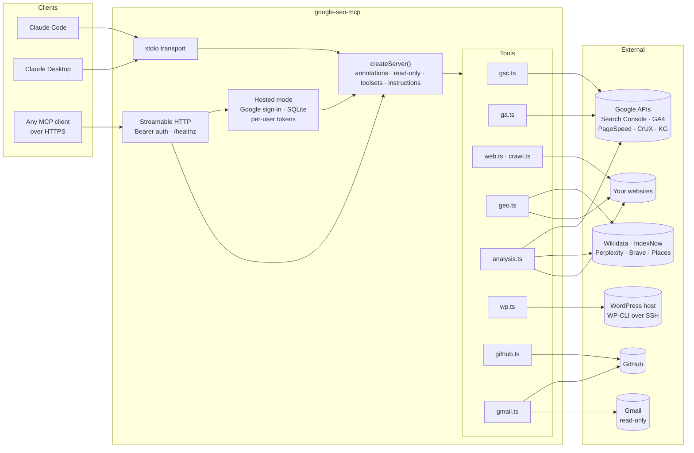

<div align="center">

# google-seo-mcp

**SEO & GEO MCP server for Claude, Codex, Cursor and any MCP client — Google Search Console, Google Analytics 4, PageSpeed Insights, structured data, llms.txt, WordPress and GitHub as 83 tools, so an assistant can diagnose and fix technical SEO, content and generative-engine-optimization issues in one conversation.**

[](https://github.com/Akxan/google-seo-mcp/stargazers)
[](LICENSE)
[](https://nodejs.org)
[](https://www.typescriptlang.org)
[](https://modelcontextprotocol.io)
[](#what-it-can-do)
[](https://github.com/Akxan/google-seo-mcp/releases)
[](https://github.com/Akxan/google-seo-mcp/actions/workflows/deploy.yml)
[](https://github.com/Akxan/google-seo-mcp/commits/main)

Google Search Console · Google Analytics 4 · PageSpeed & CrUX · on-page and GEO audits · WordPress over SSH · GitHub

[Quick start](#quick-start) · [Tools](#what-it-can-do) · [Any agent](#works-with-any-agent) · [Architecture](#architecture) · [Configuration](#configuration) · [Deploy 24/7](#running-as-a-247-http-server) · [中文文档](README.zh-CN.md)

</div>

---

## Why

**google-seo-mcp** is a [Model Context Protocol](https://modelcontextprotocol.io) server for **SEO automation with AI agents**. It connects **Google Search Console**, **Google Analytics 4 (GA4)**, **PageSpeed Insights / Core Web Vitals**, the **Chrome UX Report**, **Knowledge Graph**, **Wikidata**, **IndexNow**, **WordPress** (Yoast SEO, WP-CLI over SSH) and **GitHub**, and adds **GEO (generative engine optimization)** checks: AI crawler access for GPTBot, OAI-SearchBot, ClaudeBot and PerplexityBot, `llms.txt`, JSON-LD / schema.org structured data, E-E-A-T signals and AI citation tracking.

Most SEO MCP servers wrap one API. Real SEO work crosses several: you find a striking-distance keyword in Search Console, check the landing page's engagement in GA4, audit the page, rewrite its title and FAQ, publish the change to WordPress or a static-site repo, then watch the numbers. This server gives an assistant every step of that loop as tools, with the guard-rails a public-facing site needs: read-only mode, destructive-action annotations, and untrusted-content instructions.

## What it can do

| Area | Tools |
|---|---|
| **Search Console** (16) | `gsc_list_sites`, `gsc_search_analytics`, `gsc_site_snapshot`, `gsc_compare_periods`, `gsc_opportunities` (position 8–20 quick wins), `gsc_ctr_opportunities`, `gsc_cannibalization`, `gsc_question_queries`, `gsc_rich_results_report`, `gsc_inspect_url`, `gsc_index_coverage`, `gsc_list_sitemaps` / `gsc_submit_sitemap` / `gsc_delete_sitemap`, `gsc_add_site` / `gsc_delete_site` |
| **Google Analytics 4** (11) | `ga_list_properties`, `ga_property_config` (streams, custom dimensions/metrics, key events, audiences, Ads links, retention — read-only), `ga_run_report`, `ga_batch_run_reports`, `ga_run_pivot_report`, `ga_run_funnel_report`, `ga_run_realtime_report`, `ga_get_metadata`, `ga_check_compatibility`, `ga_compare_periods`, `ga_landing_page_seo` (organic landing pages merged with Search Console) |
| **Page & site audits** (9) | `page_audit`, `site_crawl`, `pagespeed`, `sitemap_check`, `robots_check`, `hreflang_check`, `social_preview_check`, `compare_pages`, `keyword_suggest` |
| **GEO** (12) | `ai_crawler_access`, `llms_txt_check`, `llms_txt_generate`, `structured_data_audit`, `schema_generate`, `schema_validate`, `geo_page_score`, `eeat_audit`, `knowledge_graph_check`, `indexnow_submit`, `ai_citation_check`, `brand_mentions` |
| **Analysis** (5) | `migration_check` (pre-migration URL safety net), `cross_site_links`, `content_refresh_candidates`, `crux_history`, `reviews_snapshot` |
| **WordPress** (21, optional) | `wp_site_info`, `wp_list_posts`, `wp_get_post`, `wp_update_post`, `wp_seo_status`, `wp_update_seo`, `wp_bulk_update_seo` (Yoast fields), `wp_builder_check`, `wp_builder_list_items`, `wp_builder_update` (BeTheme / Muffin Builder content), `wp_list_media`, `wp_update_media` (alt text), `wp_list_terms`, `wp_update_term`, `wp_internal_link_suggestions`, `wp_list_redirects`, `wp_add_redirect`, `wp_delete_redirect` (Yoast Premium), `wp_get_schema`, `wp_set_schema` (JSON-LD injection), `wp_run` (raw WP-CLI) |
| **GitHub** (7, optional) | `github_get_file`, `github_list_dir`, `github_search_code`, `github_list_commits`, `github_commit_files` (atomic multi-file commits with full content, in-place find/replace edits for large files, or base64 binaries), `github_commit_image` (fetch an image URL, convert to webp, resize or crop, add variants, commit), `github_commit_attachment` (same, from a Gmail attachment) (so a static site can be edited from any client) |
| **Gmail** (1, optional) | `gmail_find_attachments` (read-only search of the authorized mailbox listing each message's attachments, so a photo someone emailed lands in the repo through `github_commit_attachment` without leaving the chat) |

Plus `google_auth_status` for diagnostics. Every tool carries MCP annotations (`readOnlyHint`, `destructiveHint`, `idempotentHint`), the server publishes `instructions` for the model, and there is a read-only mode and toolset filtering.

<details>
<summary><b>Example prompts</b></summary>

- *"Give me a snapshot of example.com for the last 28 days."*
- *"Which queries rank between 8 and 20 with the most impressions, and which posts are they on?"*
- *"Audit https://example.com/guide and score it for AI answer engines."*
- *"Find question-style queries we already get impressions for and tell me where a FAQ is missing."*
- *"Check whether GPTBot, PerplexityBot and ClaudeBot can reach the homepage."*
- *"Before we move to the new host, verify every URL with traffic still resolves on new.example.com."*
- *"Rewrite the SEO title and meta description of post 515 and publish it."*
- *"Take this photo URL, make a 1200×675 webp cover plus a 1000-wide card, commit both to public/assets/img/blog/, then register the cover in src/lib/blog.js."*
- *"Alba emailed three photos yesterday. Find them, turn the first one into the cover for the new post and commit it."*

</details>

## Tech stack

| Layer | Choice | Notes |
|---|---|---|
| Runtime | Node.js ≥ 18, TypeScript 5, ES modules | no build-time codegen, `tsc` only |
| Protocol | `@modelcontextprotocol/sdk` | stdio for local clients, stateless Streamable HTTP for servers |
| Google | `googleapis` (Search Console v1, Analytics Data v1beta, Analytics Admin v1beta, Gmail v1 read-only, optional) + `google-auth-library` | REST clients, no gRPC; service account or OAuth |
| Web audits | `cheerio`, `image-size`, `sharp`, native `fetch` | PageSpeed Insights, CrUX, Knowledge Graph, Wikidata, Google Autocomplete, IndexNow, Perplexity, Brave, Places APIs over HTTPS |
| WordPress | `ssh` + WP-CLI, two PHP helpers uploaded on first use | Yoast indexable rebuild, cache purge (WP Rocket / Super Cache / W3TC / LiteSpeed), mu-plugin for JSON-LD |
| GitHub | REST + Git Data API, `sharp` for images | token from `GITHUB_TOKEN` or `gh auth token`; edits are validated to match exactly once before anything is committed |
| Hosted mode | `node:sqlite`, `google-auth-library` OAuth2, server-rendered HTML | optional multi-tenant web UI: Google sign-in, encrypted refresh tokens, per-user read-only bearer tokens |
| Validation | `zod` schemas per tool | descriptions double as LLM documentation |
| Quality | smoke test with tool-list snapshot, secret-scan git hooks | `npm test`, `npm run check:secrets` |

## Architecture



**Request path.** A client calls a tool → `src/util.ts` `tool()` wraps the handler (JSON result or an actionable `isError`) → the handler talks to one or more upstreams → results are flattened into compact JSON (`{dimension: value, metric: number}` rows, totals first). Long-running tools (`pagespeed`, `site_crawl`, `migration_check`) send progress notifications.

**Cross-source analyses** (`ga_landing_page_seo`, `migration_check`, `cross_site_links`, `content_refresh_candidates`, `gsc_opportunities`) reuse the Search Console query function and a shared URL-path normaliser so pages line up across GA4, Search Console, sitemaps and WordPress post IDs.

**WordPress path.** Every call is `ssh host 'cd <wp> && wp …'` with POSIX-quoted arguments; large payloads go over stdin. Two PHP helpers are uploaded to `~/.google-seo-mcp/` on the host when their hash changes. Yoast meta writes trigger an indexable rebuild and a cache purge so changes are live immediately.

**Hosted mode.** With the `SEO_MCP_HOSTED_*` variables set, `src/hosted/` adds a landing page, Google OAuth sign-in and a token dashboard. A `seo_…` bearer token on `/mcp` resolves to that user's encrypted refresh token, and the request runs inside an `AsyncLocalStorage` scope so every Google client created by the tools uses that grant instead of the operator's credentials; the server instance for such requests is read-only and limited to own-data toolsets.

**Safety.** Write tools are recognised by name and receive `readOnlyHint:false` (`destructiveHint:true` for deletes, raw WP-CLI and commits). `--read-only` drops them at registration; `--toolsets=gsc,web` trims the tool list (83 definitions ≈ 22k tokens). Server instructions tell the model that fetched page text and CMS content are untrusted data.

## Quick start

Requirements: Node 18+, a Google Cloud project with the **Search Console API**, **Google Analytics Data API** and **Google Analytics Admin API** enabled.

```bash
git clone https://github.com/Akxan/google-seo-mcp.git
cd google-seo-mcp
npm install
npm run build
cp .env.example .env      # fill in credentials (see below)
```

### Google credentials

**Service account (recommended, works unattended):** create a service account in the Cloud project, download its JSON key, set `GOOGLE_APPLICATION_CREDENTIALS=/path/to/key.json` in `.env`, then add the service-account email as a user on each Search Console property (permission *Full*) and each GA4 property (role *Viewer*).

**Your own Google account (OAuth):** create an OAuth client ID of type *Desktop app*, download `client_secret.json`, run

```bash
npm run auth -- --client-secret ./client_secret.json
```

and the resulting `~/.config/google-seo-mcp/credentials.json` is picked up automatically.

Lookup order: `GOOGLE_CREDENTIALS_JSON` (inline) → `GOOGLE_APPLICATION_CREDENTIALS` → `~/.config/google-seo-mcp/credentials.json` → Application Default Credentials.

**Gmail attachments (optional):** enable the Gmail API on the same Google Cloud project, create an OAuth client of type *Desktop app*, then run `npm run auth -- --gmail --client-secret ./client_secret.json` once. It writes `~/.config/google-seo-mcp/gmail.json` (read-only scope); point `GMAIL_CREDENTIALS` at it (on a server: `secrets/gmail.json`).

### Connect a client

The server speaks standard MCP over **stdio** (a local process the client starts) and **Streamable HTTP** (a remote server, see [Running as a 24/7 HTTP server](#running-as-a-247-http-server)), so any MCP client works, not only Claude. For a remote server the recipe is the same everywhere: the URL `https://mcp.example.com/mcp` plus the header `Authorization: Bearer <token>`. For a local server the client needs nothing but the command, because the server reads `.env` from its own directory at startup (environment variables passed by the client take precedence).

**Claude Code**

```bash
claude mcp add google-seo -- node /absolute/path/google-seo-mcp/dist/index.js                                     # local
claude mcp add --transport http google-seo https://mcp.example.com/mcp --header "Authorization: Bearer <token>"   # remote
```

**Claude Desktop, claude.ai and the mobile apps**: Settings → Connectors → *Add custom connector*, URL `https://mcp.example.com/mcp`, authentication *None*, and `Authorization: Bearer <token>` under *Request headers*. Local alternative for Claude Desktop (`claude_desktop_config.json`):

```json
{
  "mcpServers": {
    "google-seo": { "command": "node", "args": ["/absolute/path/google-seo-mcp/dist/index.js"] }
  }
}
```

**OpenAI Codex** (`~/.codex/config.toml`; the token is read from an environment variable, so `export GOOGLE_SEO_MCP_TOKEN=…` in your shell profile):

```toml
[mcp_servers.google-seo]
url = "https://mcp.example.com/mcp"
bearer_token_env_var = "GOOGLE_SEO_MCP_TOKEN"
tool_timeout_sec = 600          # pagespeed and site_crawl outlive Codex's 60 s default

# local alternative
# [mcp_servers.google-seo]
# command = "node"
# args = ["/absolute/path/google-seo-mcp/dist/index.js"]
```

**Cursor** (`~/.cursor/mcp.json`, or `.cursor/mcp.json` inside a project):

```json
{
  "mcpServers": {
    "google-seo": {
      "url": "https://mcp.example.com/mcp",
      "headers": { "Authorization": "Bearer <token>" }
    }
  }
}
```

**VS Code** (Copilot agent mode; `.vscode/mcp.json` or the user-level file from *MCP: Open User Configuration*):

```json
{
  "servers": {
    "google-seo": {
      "type": "http",
      "url": "https://mcp.example.com/mcp",
      "headers": { "Authorization": "Bearer <token>" }
    }
  }
}
```

**Gemini CLI** (`~/.gemini/settings.json`; `httpUrl` selects Streamable HTTP, `timeout` is in milliseconds):

```json
{
  "mcpServers": {
    "google-seo": {
      "httpUrl": "https://mcp.example.com/mcp",
      "headers": { "Authorization": "Bearer <token>" },
      "timeout": 600000
    }
  }
}
```

**Any other MCP client**: point it at `https://mcp.example.com/mcp` with that header (Streamable HTTP, stateless: every call is a `POST`, there is no session to keep), or launch `node dist/index.js` over stdio. A quick check from a shell:

```bash
curl -s https://mcp.example.com/mcp -H "Authorization: Bearer <token>" -H "Content-Type: application/json" \
  -H "Accept: application/json, text/event-stream" -d '{"jsonrpc":"2.0","id":1,"method":"tools/list"}'
```

Two things to know: `pagespeed`, `site_crawl` and `gsc_index_coverage` stream progress notifications but can run for minutes, so raise the client's per-tool timeout if it defaults to 60 s; and ChatGPT's custom connectors accept only OAuth, so they cannot use a static token yet.

## Works with any agent

MCP is an open standard, so nothing here is tied to Claude. Whatever speaks MCP connects directly; whatever can call functions connects through a thin bridge. The one hard limit is a model without function calling: it cannot call tools at all, whichever vendor it comes from.

| You have | How it connects | Notes |
|---|---|---|
| An MCP client: Claude apps, Codex, Cursor, VS Code, Gemini CLI, Cline, Cherry Studio, n8n, Dify, … | URL + `Authorization: Bearer <token>` ([Connect a client](#connect-a-client)) | Raise the per-tool timeout for `pagespeed` and `site_crawl` |
| An agent you write: Claude Agent SDK, OpenAI Agents SDK, LangChain, Google ADK, Vercel AI SDK | The SDK's MCP client, same URL and header | Examples below |
| A third-party or local model: DeepSeek, Qwen, GLM, Kimi, Ollama | An MCP client that lets you choose the model (Cherry Studio, Cline), or an SDK pointed at the provider's OpenAI-compatible `base_url` | Needs function calling; give it a trimmed read-only instance (below) |
| A no-code platform that can send a URL but no headers | A read-only instance behind a reverse-proxy path that injects the header | Keeps the main instance's token out of any URL |

### From an agent SDK

Claude Agent SDK (TypeScript; Python has the same shape):

```ts
import { query } from "@anthropic-ai/claude-agent-sdk";

for await (const m of query({
  prompt: "Snapshot example.com for the last 28 days and list the queries ranking 8-20 with the most impressions",
  options: {
    mcpServers: {
      "google-seo": {
        type: "http",
        url: "https://mcp.example.com/mcp",
        headers: { Authorization: `Bearer ${process.env.GOOGLE_SEO_MCP_TOKEN}` },
      },
    },
    allowedTools: ["mcp__google-seo__*"], // without this the agent sees the tools but will not call them
  },
})) {
  if (m.type === "result" && m.subtype === "success") console.log(m.result);
}
```

OpenAI Agents SDK (Python). The same code drives any OpenAI-compatible provider; DeepSeek shown, drop the `model=` line for OpenAI itself:

```python
import os
from agents import Agent, Runner, AsyncOpenAI, OpenAIChatCompletionsModel, set_tracing_disabled
from agents.mcp import MCPServerStreamableHttp

async def main():
    async with MCPServerStreamableHttp(
        name="google-seo",
        params={"url": "https://mcp.example.com/mcp",
                "headers": {"Authorization": f"Bearer {os.environ['GOOGLE_SEO_MCP_TOKEN']}"}},
    ) as seo:
        set_tracing_disabled(disabled=True)
        deepseek = AsyncOpenAI(base_url="https://api.deepseek.com", api_key=os.environ["DEEPSEEK_API_KEY"])
        agent = Agent(
            name="seo",
            instructions="Use the tools; quote numbers with their period and source.",
            model=OpenAIChatCompletionsModel(model="deepseek-v4-flash", openai_client=deepseek),
            mcp_servers=[seo],
        )
        result = await Runner.run(agent, "Can GPTBot and PerplexityBot fetch https://example.com/ ?")
        print(result.final_output)
```

LangChain (`langchain-mcp-adapters`), Google ADK (`MCPToolset`) and the Vercel AI SDK (`experimental_createMCPClient`) take the same URL and header.

### Third-party and local models

- Desktop: Cherry Studio and Cline let you pick DeepSeek, Qwen, GLM, Kimi or a local Ollama model and add this server as a Streamable HTTP MCP server with the Authorization header.
- The tool catalogue is about 21k tokens and travels with every turn, and 83 tools are a lot for smaller models. Point them at a second, read-only instance with a trimmed toolset and its own token, so a confused model can neither write nor see what it does not need:

```yaml
# docker-compose.yml: a second service next to the main one
  google-seo-mcp-lite:
    build: .
    restart: unless-stopped
    ports: ["127.0.0.1:8788:8080"]
    env_file: .env
    environment:
      MCP_TRANSPORT: http
      MCP_HOST: 0.0.0.0
      MCP_PORT: 8080
      MCP_AUTH_TOKEN: ${MCP_AUTH_TOKEN_LITE}     # its own token, defined in .env
      SEO_MCP_READ_ONLY: "1"
      SEO_MCP_TOOLSETS: gsc,ga4,web,analysis
      GOOGLE_APPLICATION_CREDENTIALS: /secrets/service-account.json
    volumes:
      - ./secrets/service-account.json:/secrets/service-account.json:ro
```

- Whatever you connect, tool results (Search Console rows, GA4 numbers, WordPress content) are sent to that model's provider. Choose accordingly.

### Known limits

- ChatGPT's custom connectors accept only OAuth, so a static token does not work there yet; an OAuth layer in front of the server would fix it.
- Clients that only implement the legacy HTTP+SSE transport: this server speaks Streamable HTTP only (stateless, one `POST` per call). Open an issue if you need SSE.
- Codex custom model providers must implement the Responses API, so Codex cannot drive a Chat-Completions-only provider such as DeepSeek; use an SDK or Cherry Studio for those.

## Configuration

All settings live in `.env` (see [`.env.example`](.env.example), which documents every key).

| Variable | Purpose |
|---|---|
| `GOOGLE_APPLICATION_CREDENTIALS` / `GOOGLE_CREDENTIALS_JSON` | Google auth |
| `PAGESPEED_API_KEY` | PageSpeed Insights (free; without it you share a public quota that is usually exhausted) |
| `CRUX_API_KEY`, `GOOGLE_API_KEY` | Chrome UX Report API, Knowledge Graph Search API (free; fall back to `PAGESPEED_API_KEY`) |
| `BRAVE_API_KEY`, `PERPLEXITY_API_KEY`, `GOOGLE_PLACES_API_KEY` | optional: brand mentions, AI citation check, Google reviews |
| `INDEXNOW_KEY`, `INDEXNOW_KEY_LOCATION` | optional: IndexNow submissions |
| `GITHUB_TOKEN` | GitHub tools (falls back to `gh auth token`) |
| `GMAIL_CREDENTIALS` | optional: authorized_user JSON written by `npm run auth -- --gmail` (Gmail read-only), for `gmail_find_attachments` / `github_commit_attachment` |
| `WP_SITES` | JSON array of WordPress sites reachable over SSH; omit to disable `wp_*` tools |
| `SEO_MCP_READ_ONLY=1` or `--read-only` | register no write tools |
| `SEO_MCP_TOOLSETS` or `--toolsets=` | comma list of `gsc,ga4,web,geo,analysis,wordpress,github,gmail` (`google_auth_status` is always on) |
| `SEO_MCP_MAX_RESULT_CHARS` | cap on a single tool result (default 120000); oversized arrays are trimmed with a note on how to narrow the query |
| `MCP_TRANSPORT=http`, `MCP_HOST`, `MCP_PORT`, `MCP_PATH`, `MCP_AUTH_TOKEN` | HTTP mode |
| `SEO_MCP_HOSTED_CLIENT_ID`, `SEO_MCP_HOSTED_CLIENT_SECRET`, `SEO_MCP_HOSTED_SECRET`, `SEO_MCP_PUBLIC_URL` (+ optional `SEO_MCP_DATA_DIR`, `SEO_MCP_HOSTED_CONTACT`, `SEO_MCP_HOSTED_VERIFIED`) | [Hosted mode](#hosted-mode-let-other-people-sign-in-with-google): Google sign-in for other users, per-user read-only tokens |
| `GOOGLE_OAUTH_CLIENT_SECRET_FILE` (or `--client-secret`), `GOOGLE_OAUTH_CLIENT_ID` + `GOOGLE_OAUTH_CLIENT_SECRET`, `GOOGLE_OAUTH_PORT` | `npm run auth` only: the OAuth client for the user-account flow (callback port defaults to 53682) |

Tools that need an optional key return an error explaining how to obtain it instead of silently disappearing. Empty values count as unset, including a `KEY=` that Docker passes through from an env file.

### WordPress over SSH

```
WP_SITES=[{"name":"mysite","host":"1.2.3.4","port":22,"user":"ssh_user","path":"domains/example.com/public_html"}]
```

Needs WP-CLI on the host and passwordless SSH from the machine running the server. Posts built with BeTheme's Muffin Builder (empty `post_content`) are handled by the `wp_builder_*` tools. `wp_set_schema` installs a 5-line mu-plugin that prints stored JSON-LD in `<head>`. Every write tool (and `github_commit_files`) accepts `dryRun: true` to return the current values and the intended changes without touching anything.

## Running as a 24/7 HTTP server

```bash
MCP_TRANSPORT=http MCP_AUTH_TOKEN=$(openssl rand -hex 32) node dist/index.js --http
curl http://127.0.0.1:8080/healthz
```

Stateless Streamable HTTP: a fresh server instance per request, Bearer-token auth, loopback bind by default. Every write-tool call leaves one audit line on stderr (tool, outcome, duration, client, identifiers such as post id or file paths; never content), so `docker logs` shows who changed what. `/healthz` answers `{"ok":true}` without a token and adds the version and credential source when the request carries the Bearer token. `deploy/vps-self-update.sh` updates a Docker deployment in place, and `.github/workflows/deploy.yml` runs it on every push to `main` through a forced-command SSH deploy key stored in repository secrets (`VPS_HOST`, `VPS_USER`, `VPS_SSH_KEY`, `VPS_KNOWN_HOSTS`). [`deploy/`](deploy/) contains a systemd unit, an env-file example and Caddy/Nginx reverse-proxy samples (Nginx needs `proxy_buffering off`). `Dockerfile` and `docker-compose.yml` are provided. Connect remote clients with

Client-side setup for the remote server (Claude apps, Codex, Cursor, VS Code, Gemini CLI, anything else that speaks MCP) is under [Connect a client](#connect-a-client).

## Hosted mode: let other people sign in with Google

The same binary can run as a small multi-tenant service: a landing page, *Sign in with Google*, and a dashboard where each user creates personal bearer tokens for `/mcp`. Users grant **read-only** Search Console and GA4 scopes; their refresh tokens are stored encrypted (AES-256-GCM) in a SQLite file (`node:sqlite`, no extra dependency) and every `/mcp` request carrying a `seo_…` token runs against that user's Google account, with a read-only server limited to the `gsc`, `ga4`, `web`, `geo` and `analysis` toolsets (tools that write, that need SSH/GitHub/Gmail credentials, or that spend paid third-party quotas are not registered). Your own `MCP_AUTH_TOKEN` keeps working unchanged with the full tool set.

1. In Google Cloud create an OAuth client of type **Web application** with the authorised redirect URI `https://mcp.example.com/oauth/callback`, enable the Search Console and Analytics Data/Admin APIs, and add the `webmasters.readonly` and `analytics.readonly` scopes on the consent screen. While the consent screen is unverified, Google shows a warning and caps sign-ins at 100 users; publishing to everyone requires [Google's OAuth verification](https://support.google.com/cloud/answer/13463073).
2. Set the four variables together (`.env`): `SEO_MCP_HOSTED_CLIENT_ID`, `SEO_MCP_HOSTED_CLIENT_SECRET`, `SEO_MCP_HOSTED_SECRET` (`openssl rand -hex 32`), `SEO_MCP_PUBLIC_URL`. Optional: `SEO_MCP_DATA_DIR` (database location; the Docker image uses `/data`, mounted from `./data`), `SEO_MCP_HOSTED_CONTACT` (shown on the privacy page), `SEO_MCP_HOSTED_VERIFIED=1` once Google has verified the app.
3. Restart. `/` serves the landing page (English and Chinese), `/login` starts the Google flow, `/dashboard` manages tokens (up to 10 per user, shown once, revocable), `/privacy` and `/terms` are the legal pages Google's verification asks for, and *Disconnect* revokes the Google grant and deletes the user's record and tokens.

Cookies are `HttpOnly`, `SameSite=Lax` and `Secure` behind HTTPS; forms carry a CSRF token; the OAuth `state` is signed. Sign-ins and disconnects leave one JSON line on stderr (user id only). Leave all four variables empty and nothing of this exists: the server stays a private single-user instance.

## Development

```bash
npm run dev            # tsx src/index.ts (stdio, no build)
npm run build          # tsc -> dist/
npm test               # unit tests (node:test), smoke test (annotations, instructions, tool-list snapshot), README count check
npm run inspector      # MCP Inspector against dist/
npm run check:secrets  # scan tracked files for keys / personal data (also pre-commit and pre-push hooks)
```

```
src/
├── index.ts        entry: stdio or --http
├── server.ts       createServer(): registration wrapper, annotations, read-only, toolsets, instructions
├── http.ts         Streamable HTTP transport with Bearer auth
├── google.ts       GoogleAuth + googleapis clients
├── env.ts          .env loader
├── gmail.ts        Gmail read-only client (optional)
├── util.ts         tool() wrapper, error formatting, date helpers, progress heartbeat
└── tools/          gsc · ga · web · crawl · geo · analysis · wp · github · gmail
scripts/            wp-helper.php · mfn-builder.php (uploaded to the WordPress host) · check-secrets.sh
deploy/             systemd · Caddy · Nginx samples
test/               unit tests · smoke test · tool snapshot
```

## Notes and limits

- Search Console data lags 2–3 days; end date ranges at `3daysAgo`. URL Inspection has a ~2,000 calls/day quota per property.
- PageSpeed runs take 15–60 s; the tool retries once and sends progress notifications. Pages that never become idle cannot be audited by Lighthouse.
- CrUX only has data for origins with enough Chrome traffic.
- All fetched page text and CMS content is untrusted third-party data; the server instructions tell the model not to follow instructions found in it.

## Contributing

Issues and pull requests are welcome. CI runs build, tests and the secret scan on every push and pull request; `main` deploys only after they pass. Add new tools to the matching `src/tools/*.ts` module, give every parameter a `.describe()`, run `npm run docs:sync`, and add a line to `CHANGELOG.md`.

## Keywords

MCP server · Model Context Protocol · SEO MCP · GEO · generative engine optimization · AI SEO agent · Claude MCP · Claude Code · OpenAI Codex MCP · Cursor MCP · Gemini CLI MCP · Claude Agent SDK · OpenAI Agents SDK · LangChain MCP · n8n · Dify · DeepSeek · Google Search Console API · Google Analytics 4 API · GA4 Data API · PageSpeed Insights API · Core Web Vitals · CrUX · technical SEO audit · site crawler · static site publishing · Astro · Cloudflare Pages · webp image pipeline · Gmail attachments · structured data · schema.org · JSON-LD · FAQPage · llms.txt · AI crawlers · GPTBot · ClaudeBot · PerplexityBot · robots.txt · sitemap · hreflang · keyword cannibalization · striking distance keywords · content decay · E-E-A-T · Knowledge Graph · IndexNow · WordPress SEO automation · Yoast SEO · WP-CLI · TypeScript

## Star history

[](https://star-history.com/#Akxan/google-seo-mcp&Date)

## License

[MIT](LICENSE)

## Community

This project takes part in and acknowledges the [LINUX DO](https://linux.do/) community. 本项目积极参与并认可 [linux.do 社区](https://linux.do/)。
